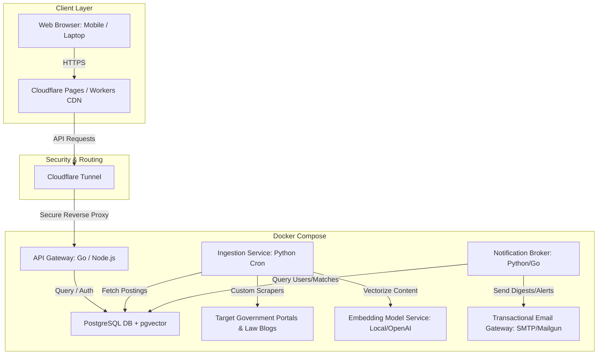
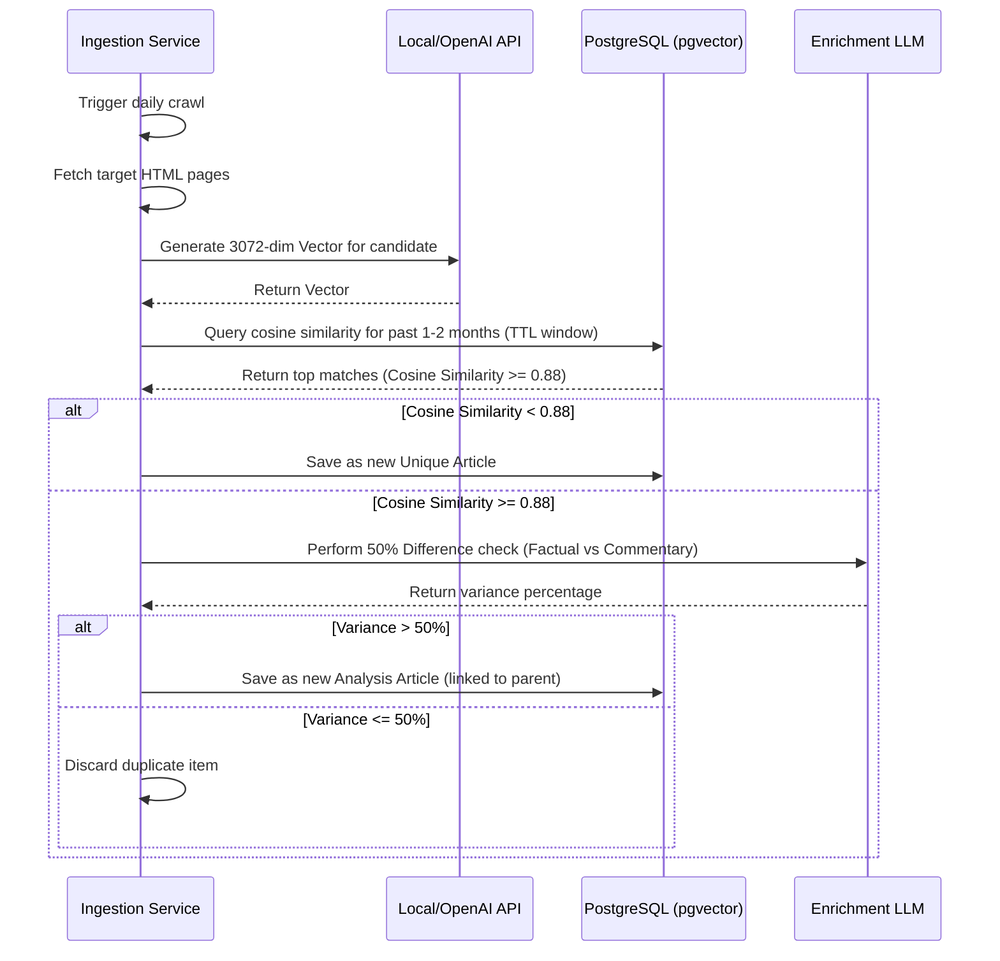

# ImmiPulse - System Architecture Design

## 1. Introduction & System Overview
ImmiPulse is a vertical web application designed to harvest, deduplicate, tag, and deliver curated global immigration news. The system utilizes a bright, vivid, light-mode responsive web interface for users, a highly automated data ingestion pipeline, a semantic deduplication core implementing the 50% Difference Principle, and a notification broker to distribute digests and alerts. 

The architecture is split into a **Cloudflare-hosted Frontend** and a **Dockerized Backend** exposed securely via a **Cloudflare Tunnel**.

---

## 2. Overall System Architecture

---

## 3. Module Decomposition & Service Responsibilities

### 3.1 Frontend Web Application
- **Stack**: Single Page Application (SPA) built with React/Vite, styled with modern Vanilla CSS matching a bright, vivid light-mode theme. Hosted on **Cloudflare Pages**.
- **Responsibilities**:
  - Render the daily feed (capped at 10 items, diversity-enforced).
  - Handle user registration, login, and preference settings (jurisdiction and tag multi-selects).
  - Provide a dashboard for Premium users to configure custom keyword alerts.
  - Support guest mode: Unregistered users can view the global feed (unfilterable).

### 3.2 Ingestion & Enrichment Service (Docker Service: `ingestion-service`)
- **Stack**: Python daemon running inside a Docker container.
- **Responsibilities**:
  - Run custom web scrapers targeting 22+ mainstream jurisdictions.
  - Normalizer: Convert HTML/JSON structures into standardized schemas, enforcing UTF-8 encoding for localized characters and ISO 8601 UTC timestamp conversions.
  - Scheduler: Configurable cron engine executing once per day by default, supporting run frequencies as high as every 4 hours.
  - Embedding Generator: Call configurable embedding models (local model or OpenAI API) to obtain text representations.
  - Deduplication Engine: Match incoming entries against PostgreSQL global articles, applying the **50% Difference Principle** (filtering duplicates, saving only unique items).
  - Classification: Apply zero-shot tagging for jurisdictions and lifestyle feature tags (excluding Language).

### 3.3 API Gateway & User Service (Docker Service: `api-gateway`)
- **Stack**: Go or Node.js running inside a Docker container.
- **Responsibilities**:
  - Route HTTP traffic securely behind the Cloudflare Tunnel.
  - Authenticate users using JWT tokens (User levels: Basic, Premium).
  - Serve the personalized news feed dynamically. Apply preferences and execute the **Diversity Algorithm** (limiting any single jurisdiction to a maximum of 2 items in the returned feed).
  - Manage subscription preferences and Premium user keyword alerts.

### 3.4 Notification Broker (Docker Service: `notification-broker`)
- **Stack**: Python or Go daemon running inside Docker.
- **Responsibilities**:
  - Listen for database insertions to match Premium users' keyword rules.
  - Trigger immediate transactional email dispatches for keyword alert matches.
  - Compile and send daily or weekly personalized email digests to Basic and Premium users.

---

## 4. Ingestion and Deduplication Data Flow

---

## 5. Security & Network Considerations
- **Zero Exposed Ports**: Docker Compose services run on a private network bridge. Only the `api-gateway` port is mapped to the host, and it is strictly protected by the `cloudflared` daemon tunnel. All external traffic must pass through Cloudflare validation.
- **Authentication**: JWT-based session management. Passwords stored using Argon2id or bcrypt in PostgreSQL.
- **Scraper Safety**: Custom scrapers run with random user-agents, polite crawl delays, and simple header variations to avoid triggering rate-limits on government sites. No third-party proxy provider is required.

---

## 6. Scalability, Reliability, & Observability
- **Data Lifecycle (TTL)**: PostgreSQL articles table implements a 1-to-2 month configurable TTL. A daily cron job deletes vectors and raw articles older than the TTL limit to maintain sub-second index search times.
- **Diversity Algorithm Engine**: Executed at read-time in the `api-gateway`. It processes the candidate articles, selects the top 10 based on publication date and preferences, while enforcing the constraint `count(jurisdiction) <= 2`.
- **Health Checks & Monitoring**:
  - Automated endpoint monitoring for the `api-gateway`.
  - Ingestion service logs successes/failures into `scraper_logs` table. If any scraper fails to fetch successfully for 48 hours, an alert is triggered.
