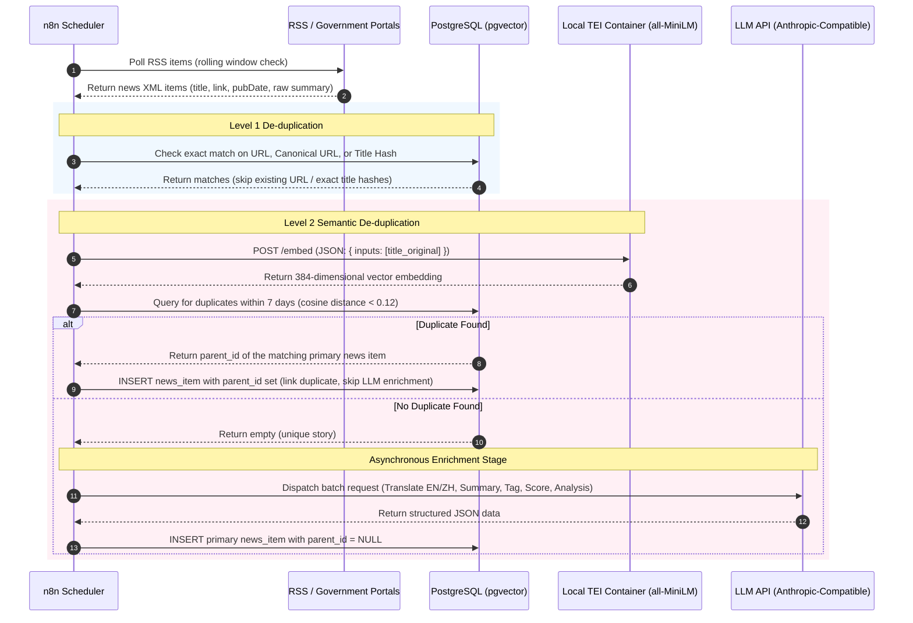

# Technical Architecture: Yutian Immigration AI Newsroom

This document defines the high-level system architecture, component decomposition, network topology, deployment configuration, and data flows for the **Yutian Immigration AI Newsroom**.

---

## 1. System Overview & Context

The Yutian Immigration AI Newsroom is structured as a hybrid, local-first system. The frontend is deployed globally at the edge for low latency and high availability, while all processing pipelines, database storage, and backend APIs run in a secure, self-hosted Dockerized environment.

```mermaid
graph TD
    %% Clients & Public Network
    User[Creator / Browser] <-->|HTTPS| CFEdge[Cloudflare Edge Network]
    CFEdge <-->|Next.js Pages Hosting| NextJS[Next.js Dashboard UI]
    
    %% Secure Connection
    NextJS <-->|API Traffic via Cloudflare Tunnel| CFTunnel[Cloudflare Tunnel client: cloudflared]
    
    %% Self-Hosted Infrastructure Boundary
    subgraph Ubuntu Server (Self-Hosted Docker Compose Environment)
        CFTunnel <-->|Internal Port HTTP| FastAPI[FastAPI Backend]
        FastAPI <-->|SQL / vector queries| PostgreSQL[(PostgreSQL + pgvector)]
        
        %% Ingestion Pipeline
        n8n[n8n Workflow Engine] -->|Write Metadata| PostgreSQL
        n8n -->|HTTP /embed| TEI[Local Text Embeddings Inference: TEI]
        
        %% Cron Trigger
        Cron[n8n Trigger] -->|Every 3-4 Hours| n8n
    end
    
    %% External Cognitive Services
    n8n <-->|HTTPS / Messages API| LLM[LLM API (Anthropic-Compatible)]
    
    %% External Ingestion Feeds
    RSS[External RSS / Govt Portals] -->|Poll Feeds| n8n
```

---

## 2. Component Decomposition

### 2.1 Next.js Edge Frontend
* **Hosting**: Cloudflare Pages.
* **Responsibilities**:
  - Render the interactive feed grid and sidebar layout.
  - Implement instant client-side searching, filter switching (countries, topics, audiences), and threshold filtering.
  - Show candidate stories planning board.
  - Provide a detail view drawer for selected articles.
  - Expose editor input forms for editing candidate recommended titles and saving manual production notes.

### 2.2 FastAPI Backend
* **Hosting**: Docker container on self-hosted Ubuntu Server.
* **Responsibilities**:
  - Expose REST API endpoints servicing the frontend's queries.
  - Authenticate incoming requests using a basic API token verification middleware.
  - Execute PostgreSQL read queries (filtering by tags, pagination, text search, sorting by scores, and hiding/showing low relevance items).
  - Execute PostgreSQL write commands (starring/unstarring candidates, modifying notes).

### 2.3 PostgreSQL + pgvector Database
* **Hosting**: Docker container on self-hosted Ubuntu Server.
* **Responsibilities**:
  - Store structured article metadata (original/EN/ZH titles and summaries, tags, scores, source URLs).
  - Store vector embeddings for titles to perform fast cosine similarity searches (Level 2 de-duplication).
  - Store candidates table (linked to news items, holding notes, titles, and creation stamps).
  - Execute automated data retention purge routines daily.

### 2.4 n8n Workflow Engine
* **Hosting**: Docker container on self-hosted Ubuntu Server.
* **Responsibilities**:
  - Poll RSS feeds (Google Alerts and official websites) periodically.
  - Filter incoming feed entries using exact URL and title matches (Level 1 de-duplication).
  - Dispatch requests to the local embedding container to vectorize incoming story titles.
  - Query PostgreSQL using `pgvector` to identify and group semantic duplicates (Level 2 de-duplication).
  - Dispatch asynchronous batch requests to the configured LLM for translations, multi-dimensional scoring, tag extraction, AI analysis paragraphs, and recommended titles.
  - Insert fully enriched metadata records into PostgreSQL.

### 2.5 Local Text Embeddings Inference (TEI) Container
* **Hosting**: Docker container on self-hosted Ubuntu Server.
* **Responsibilities**:
  - Serve the optimized HuggingFace `all-MiniLM-L6-v2` model using HuggingFace's Rust-based Text Embeddings Inference container.
  - Expose an ultra-fast `/embed` HTTP endpoint to vectorize incoming titles.
  - Maintain absolute data privacy and eliminate third-party API vector generation fees.

---

## 3. Data Flows

### 3.1 Curation and Enrichment Ingestion Pipeline (Every 3-4 Hours)



### 3.2 Frontend Request & Detail Drawer Lifecycle
1. **User Action**: The creator opens the dashboard.
2. **Retrieve News Feed**: The Next.js UI makes a secure request (`GET /api/news?page=1&limit=25&hide_low_relevance=true`) to the FastAPI backend.
3. **Internal Filtering**: The FastAPI backend executes a database query matching filters, returning only primary stories (`parent_id IS NULL`).
4. **View Details**: The user clicks a story card. Next.js triggers a side drawer transition.
5. **Get Item Details**: The drawer fetches detail metadata (`GET /api/news/{id}`). FastAPI runs a query to fetch the news item information along with any duplicate sources:
   ```sql
   SELECT source_name, source_url 
   FROM news_items 
   WHERE id = :id OR parent_id = :id;
   ```
6. **Interaction**: The user views translations, AI analyses, and stars the item as a candidate. Next.js calls `POST /api/candidates/{id}/star` to persist the selection.

---

## 4. Network Security & Cloudflare Tunnel Topology

To secure the self-hosted infrastructure, the FastAPI backend and database are deployed behind a closed firewall without public port exposure. All external communication is handled via a secure outbound web socket tunnel.

```
┌────────────────────────────────────────┐       ┌──────────────────────────────────────────────┐
│        Cloudflare Edge Network         │       │          Self-Hosted Ubuntu Server           │
│                                        │       │                                              │
│  ┌──────────────────┐                  │       │  ┌──────────────────────┐                    │
│  │Next.js Dashboard │                  │       │  │ cloudflared Container│                    │
│  │ (CF Pages Edge)  │                  │       │  │                      │                    │
│  └────────┬─────────┘                  │       │  │ Outbound tunnel      │                    │
│           │                            │       │  │ connection (Port 443)│                    │
│           │ HTTPS Request              │       │  └──────────┬───────────┘                    │
│           ▼                            │       │             │                                │
│  ┌──────────────────┐                  │       │             │ Proxy HTTP requests            │
│  │Cloudflare DNS /  ├──────────────────┼───────┼─────────────▼                                │
│  │ Tunnel Gateway   │  Secure Tunnel   │       │  ┌──────────────────────┐                    │
│  │                  │  (Outbound HTTP/2)│       │  │ FastAPI Container    │                    │
│  └──────────────────┘                  │       │  └──────────────────────┘                    │
└────────────────────────────────────────┘       └──────────────────────────────────────────────┘
```

* **Authentication Protocol**: An API token (configured via `DASHBOARD_API_TOKEN`) is passed as an `Authorization: Bearer <token>` header in all requests from the Next.js frontend to protect API routes.
* **Firewall Configuration**: Ports 8000 (FastAPI), 5432 (PostgreSQL), and 5678 (n8n UI) are bound strictly to localhost (`127.0.0.1`) or kept internal to the Docker bridge network. They are not opened to the public internet interface.

---

## 5. Docker Compose Configuration (Reference)

```yaml
version: '3.8'

services:
  postgres:
    image: pgvector/pgvector:0.7.0-pg16
    container_name: immipulse-db
    restart: unless-stopped
    environment:
      POSTGRES_DB: immipulse
      POSTGRES_USER: ${DB_USER:-yutian}
      POSTGRES_PASSWORD: ${DB_PASSWORD}
    volumes:
      - pgdata:/var/lib/postgresql/data
    networks:
      - internal-net
    ports:
      - "127.0.0.1:5432:5432"

  tei-embeddings:
    image: ghcr.io/huggingface/text-embeddings-inference:cpu-1.2
    container_name: immipulse-embeddings
    restart: unless-stopped
    command: --model-id sentence-transformers/all-MiniLM-L6-v2
    volumes:
      - tei-cache:/data
    networks:
      - internal-net

  n8n:
    image: docker.n8n.io/n8nio/n8n:latest
    container_name: immipulse-n8n
    restart: unless-stopped
    environment:
      - N8N_HOST=localhost
      - N8N_PORT=5678
      - N8N_PROTOCOL=http
      - DATABASE_TYPE=postgresdb
      - DB_POSTGRESDB_HOST=postgres
      - DB_POSTGRESDB_PORT=5432
      - DB_POSTGRESDB_DATABASE=immipulse
      - DB_POSTGRESDB_USER=${DB_USER:-yutian}
      - DB_POSTGRESDB_PASSWORD=${DB_PASSWORD}
      - LLM_API_KEY=${LLM_API_KEY}
      - LLM_API_URL=${LLM_API_URL}
      - LLM_MODEL=${LLM_MODEL}
    volumes:
      - n8n_data:/home/node/.n8n
    networks:
      - internal-net
    ports:
      - "127.0.0.1:5678:5678"

  backend:
    build:
      context: ./backend
      dockerfile: Dockerfile
    container_name: immipulse-backend
    restart: unless-stopped
    environment:
      - DATABASE_URL=postgresql://${DB_USER:-yutian}:${DB_PASSWORD}@postgres:5432/immipulse
      - DASHBOARD_API_TOKEN=${DASHBOARD_API_TOKEN}
    depends_on:
      - postgres
    networks:
      - internal-net
    ports:
      - "127.0.0.1:8000:8000"

  cloudflared:
    image: cloudflare/cloudflared:latest
    container_name: immipulse-tunnel
    restart: unless-stopped
    command: tunnel --no-autoupdate run
    environment:
      - TUNNEL_TOKEN=${TUNNEL_TOKEN}
    depends_on:
      - backend
    networks:
      - internal-net

networks:
  internal-net:
    driver: bridge

volumes:
  pgdata:
  tei-cache:
  n8n_data:
```

---

## 6. System Design Considerations

### 6.1 Reliability & Error Handling
* **LLM Call Retries**: n8n workflows will utilize retry handlers with exponential backoff on LLM API connections to survive API rate-limiting or brief network issues.
* **Webhook Timeout Mitigation**: In n8n, when processing parallel chunks of Google Alerts RSS feeds, we use a webhook worker pattern or an asynchronous batching structure. Rather than blocking the main RSS collector execution, n8n queues URLs and processes them asynchronously via worker loops, preventing webhook timeout constraints.
* **Local Embedding Availability**: Because the TEI service is hosted locally in the same Docker Compose network, we bypass public network latency and egress fees, guaranteeing high embedding throughput.

### 6.2 Observability & Maintenance
* **Logs**: FastAPI container logs utilize structured JSON logging for monitoring route requests and database response latencies.
* **Database Maintenance**: A nightly database routine executes vacuum analyses to optimize index sizes and updates search histograms.
* **Version Tracking**: Records are tagged with `workflow_version` and `processing_version` to track updates to schemas, prompt architectures, or de-duplication rules without losing historical tracing.
