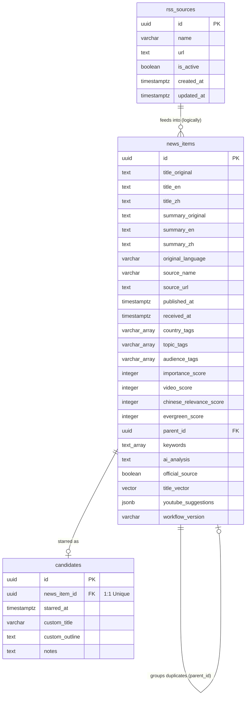

# Database Schema Design: Yutian Immigration AI Newsroom

This document defines the PostgreSQL database schema, data models, table fields, relational integrity, indexing strategy, and data retention queries for the **Yutian Immigration AI Newsroom**.

---

## 1. Database Extensions

The system utilizes `pgvector` for semantic cosine similarity searches. The extension must be enabled before table creation:

```sql
CREATE EXTENSION IF NOT EXISTS vector;
CREATE EXTENSION IF NOT EXISTS "uuid-ossp";
```

---

## 2. Entity-Relationship Diagram (ERD)



---

## 3. Schema DDL Statements

### 3.1 news_items Table
Stores all ingested news article metadata, including translated fields, calculated classification tags, and scoring models.

```sql
CREATE TABLE news_items (
    id UUID PRIMARY KEY DEFAULT gen_random_uuid(),
    
    -- Titles (Translations Matrix)
    title_original TEXT NOT NULL,
    title_en TEXT NOT NULL,
    title_zh TEXT NOT NULL,
    
    -- Summaries (Translations Matrix)
    summary_original TEXT NOT NULL,
    summary_en TEXT NOT NULL,
    summary_zh TEXT NOT NULL,
    
    -- Source and Metadata
    original_language VARCHAR(10) NOT NULL,
    source_name VARCHAR(100) NOT NULL,
    source_url TEXT NOT NULL UNIQUE,
    published_at TIMESTAMPTZ NOT NULL,
    received_at TIMESTAMPTZ NOT NULL DEFAULT CURRENT_TIMESTAMP,
    
    -- Classification Tags (Arrays)
    country_tags VARCHAR(50)[] NOT NULL DEFAULT '{}',
    topic_tags VARCHAR(50)[] NOT NULL DEFAULT '{}',
    audience_tags VARCHAR(50)[] NOT NULL DEFAULT '{}',
    
    -- Multi-Dimensional Grading Scores (0 - 100)
    importance_score INTEGER NOT NULL CHECK (importance_score BETWEEN 0 AND 100),
    video_score INTEGER NOT NULL CHECK (video_score BETWEEN 0 AND 100),
    chinese_relevance_score INTEGER NOT NULL CHECK (chinese_relevance_score BETWEEN 0 AND 100),
    evergreen_score INTEGER NOT NULL CHECK (evergreen_score BETWEEN 0 AND 100),
    
    -- Duplicate Group (Self-Referencing ForeignKey)
    parent_id UUID REFERENCES news_items(id) ON DELETE SET NULL,
    
    -- AI Generated Insights
    keywords TEXT[] NOT NULL DEFAULT '{}',
    ai_analysis TEXT,
    official_source BOOLEAN NOT NULL DEFAULT FALSE,
    youtube_suggestions JSONB NOT NULL DEFAULT '{}'::jsonb, -- {"titles": ["Title 1", "Title 2"], "thumbnail_prompt": "Prompt"}
    
    -- Vector Embeddings for level 2 de-duplication (384 dimensions for paraphrase-multilingual-MiniLM-L12-v2)
    title_vector VECTOR(384),
    
    -- Version Audit
    workflow_version VARCHAR(20) NOT NULL DEFAULT '1.0.0'
);
```

### 3.2 candidates Table
Stores custom notes, video outlines, and alternative titles for news items selected by the creator for production.

```sql
CREATE TABLE candidates (
    id UUID PRIMARY KEY DEFAULT gen_random_uuid(),
    news_item_id UUID NOT NULL UNIQUE REFERENCES news_items(id) ON DELETE CASCADE,
    starred_at TIMESTAMPTZ NOT NULL DEFAULT CURRENT_TIMESTAMP,
    custom_title VARCHAR(200),
    custom_outline TEXT,
    notes TEXT
);
```

### 3.3 rss_sources Table
Stores metadata and target URLs for external RSS feed sources. n8n polls active items from this table to run sub-workflow ingestions.

```sql
CREATE TABLE rss_sources (
    id UUID PRIMARY KEY DEFAULT gen_random_uuid(),
    name VARCHAR(100) NOT NULL,
    url TEXT NOT NULL UNIQUE,
    is_active BOOLEAN NOT NULL DEFAULT TRUE,
    created_at TIMESTAMPTZ NOT NULL DEFAULT CURRENT_TIMESTAMP,
    updated_at TIMESTAMPTZ NOT NULL DEFAULT CURRENT_TIMESTAMP
);

-- Index on is_active for faster lookup in n8n poll master
CREATE INDEX idx_rss_sources_is_active ON rss_sources (is_active) WHERE is_active = TRUE;
```


---

## 4. Indexing Strategy

To support fast client-side dashboard queries, filtering by tags, text searches, and semantic vector comparisons, the following indexes are constructed:

```sql
-- 1. B-tree index for filtering out duplicate reports in the main feed
CREATE INDEX idx_news_items_parent_id ON news_items (parent_id) WHERE parent_id IS NULL;

-- 2. B-tree index for sorting results by publication date and score rankings
CREATE INDEX idx_news_items_published_at ON news_items (published_at DESC);
CREATE INDEX idx_news_items_scores ON news_items (video_score DESC, chinese_relevance_score DESC);

-- 3. GIN index for tag arrays matching fast dashboard multi-select filters
CREATE INDEX idx_news_items_country_tags ON news_items USING GIN (country_tags);
CREATE INDEX idx_news_items_topic_tags ON news_items USING GIN (topic_tags);
CREATE INDEX idx_news_items_audience_tags ON news_items USING GIN (audience_tags);

-- 4. HNSW Vector Cosine Similarity index for Level 2 semantic duplicate checks
-- Requires pgvector 0.5.0+. Uses cosine distance search parameters.
CREATE INDEX idx_news_items_title_vector ON news_items USING hnsw (title_vector vector_cosine_ops);
```

---

## 5. Data Retention & Purge Logic

To maintain a lightweight database and respect copyright metadata guidelines, a cron-based purge script runs daily to delete articles older than 14 days. 

To preserve candidate relationships, the deletion excludes:
- Starred items present in the `candidates` table.
- Primary parents of duplicate groups that have a child starred in the `candidates` table.

```sql
DELETE FROM news_items
WHERE published_at < NOW() - INTERVAL '14 days'
  -- Exclude starred news items
  AND id NOT IN (
      SELECT news_item_id 
      FROM candidates
  )
  -- Exclude parent items whose children are candidates
  AND id NOT IN (
      SELECT DISTINCT parent_id 
      FROM news_items 
      WHERE parent_id IS NOT NULL 
        AND id IN (SELECT news_item_id FROM candidates)
  );
```
