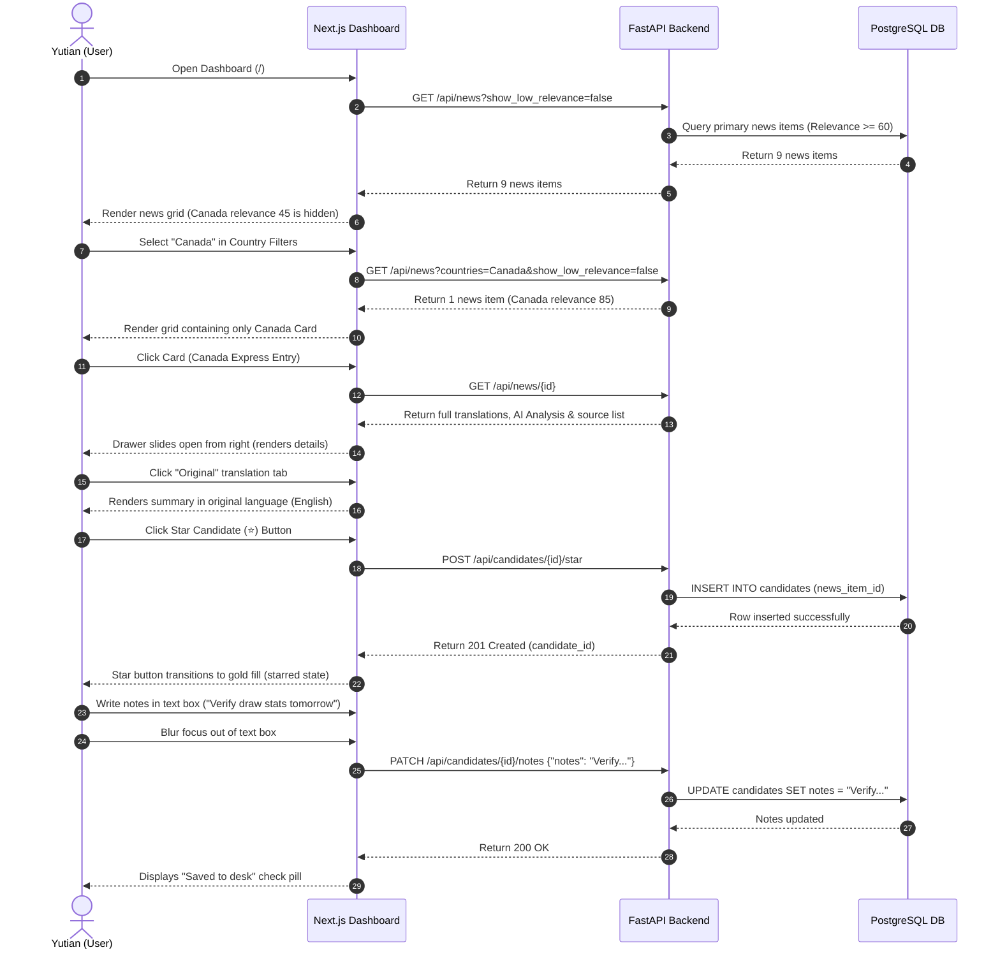
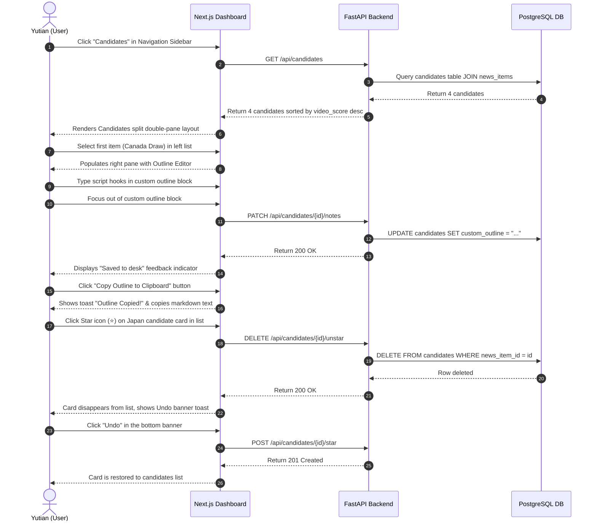

# E2E Test Scenarios: Yutian Immigration AI Newsroom (ImmiPulse)

This document specifies the end-to-end (E2E) testing scenarios for **ImmiPulse**, simulating real user behaviors across screen transitions, API requests, database mutations, and external actions.

---

## E2E-001: Daily News Review Journey

### Objectives
Verify that the creator can review daily ingested news, apply filters, examine specific policy updates in the detail drawer, click to verify official sources, star the story as a candidate, and write initial notes.

### Prerequisites
- FastAPI backend, PostgreSQL, local TEI container, and Next.js frontend are running.
- Ingestion pipeline has recently loaded 10 new articles into the database:
  - 2 articles on Canada (one with relevance 85, one with relevance 45).
  - 1 article on Japan (relevance 80).
  - 7 other global articles.

### Test Steps & Assertions



### Validation & Verification
1. **Traceability check**:
   - Verify that `is_starred` matches true in database.
   - Verify that the card grid scroll position was preserved throughout transitions.
   - Verify clicking the original link opened a new browser tab without losing state.
2. **Error Recovery Branch**:
   - If the note PATCH fails (e.g. timeout), verify a warning toast shows: "Sync Failed. Retrying...". Clicking retry successfully repeats the step.

- **Traceability**: [User-Flows: Section 2.1](file:///Users/victorxu/projects/immi_pulse/docs/User-Flows.md#L26), [PRD: US-5, US-7, US-8](file:///Users/victorxu/projects/immi_pulse/docs/PRD.md#L103)

---

## E2E-002: Weekly Planning & Script Drafting Journey

### Objectives
Verify that the creator can review the accumulated starred pool, select the optimal topic, draft and flesh out the script outline in the double-pane workspace, export the content to the clipboard, and clean up unstarred candidates.

### Prerequisites
- Candidates table contains 4 starred items:
  - Canada Express Entry Draw (Video Score: 82)
  - Japan highly skilled visas (Video Score: 75)
  - UK student visa updates (Video Score: 60)
  - Spain Nomad updates (Video Score: 55)

### Test Steps & Assertions



### Validation & Verification
1. **Clipboard content formatting**:
   - Read clipboard buffer and assert contents match the standard format:
     ```markdown
     # Video Topic: [Selected Custom Title]
     
     ## AI Demographic Impact Analysis
     [AI Analysis Text]
     
     ## Creator Script Outline
     [Custom Creator Outline Text]
     
     ## Reference Sources
     - Source 1: [URL]
     ```
2. **Transition/Collapse check**:
   - Resize viewport to mobile (<768px). Assert layout changes from split double-pane to single vertical card stack, and clicking a card slides the outline editor up as a bottom sheet.

- **Traceability**: [User-Flows: Section 2.2](file:///Users/victorxu/projects/immi_pulse/docs/User-Flows.md#L76), [PRD: US-8](file:///Users/victorxu/projects/immi_pulse/docs/PRD.md#L107), [UI-Layouts: Section 4](file:///Users/victorxu/projects/immi_pulse/docs/UI-Layouts.md#L103)
