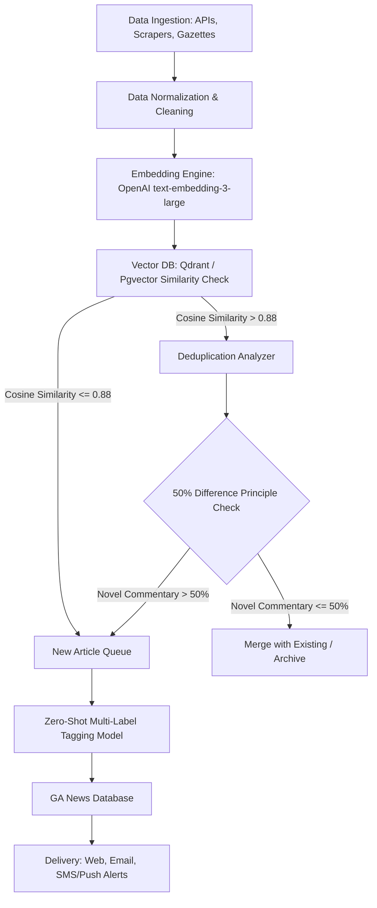

# ImmiPulse - General Availability (GA) Research Report

## Executive Summary
This report presents comprehensive market, competitive, technical, and regulatory research for the General Availability (GA) launch of **ImmiPulse**—a vertical, highly timely global immigration news and policy aggregator. The core GA objective is to establish a production-grade, highly automated ingestion and semantic deduplication pipeline covering all mainstream immigration destination countries. 

Rather than relying purely on simple RSS feeds, the GA system integrates official gazettes, APIs, web-scraped government portals, court precedents, and professional legal networks. The proprietary **50% Difference Principle** is implemented at scale using a hybrid pipeline (vector similarity combined with LLM-based entity and novelty analysis) to filter out redundant reports while retaining high-value professional commentary. This research validates that delivering an ad-free, curated, and transparent global policy database with a hard cap of 10 daily high-impact stories represents a major market opportunity.

---

## Research Objectives
- Map and analyze data ingestion sources across all mainstream global immigration destinations.
- Define a production architecture for non-RSS data harvesting, including APIs, gazettes, and web scrapers.
- Establish the technical blueprint for the semantic deduplication engine and the "50% Difference Principle" at GA scale.
- Identify the target customer segments, user pain points, and competitor landscape.
- Assess regulatory compliance, business risks, and technical challenges for a global GA launch.

---

## Key Assumptions
1. **Scrapability of Sources**: Government immigration websites and official gazettes are programmatically accessible, and anti-scraping defenses (e.g., Cloudflare) can be bypassed legally via proxy networks or official APIs.
2. **Value of Noise Elimination**: High-value users (immigrants, relocation managers, HR professionals) are willing to pay for a unified, noise-free, and deduplicated news stream to avoid missing critical policy deadlines.
3. **Feasibility of Automated Curation**: A combination of vector embeddings and LLM analysis can consistently classify and tag unstructured policy changes without requiring heavy manual editorial overhead.

---

## Market Analysis & Destination Coverage
The GA release target focuses on all mainstream global migration and mobility destination countries, classified into regional hubs:

### 1. North America
- **United States**: Focuses on H-1B caps, employment-based visa backlogs (EB-1/2/3), DOS Visa Bulletin releases, and USCIS filing fee adjustments.
- **Canada**: Focuses on Express Entry draws (general and category-based), Provincial Nominee Programs (PNPs), study permit caps, and temporary resident volume controls.

### 2. Europe & United Kingdom
- **United Kingdom**: Focuses on Skilled Worker visa salary thresholds, Sponsor License compliance, and shortage occupation adjustments.
- **Ireland**: Focuses on Critical Skills Employment Permits, Stamp 4 updates, and investor visa adjustments.
- **European Schengen Area (Germany, France, Spain, Portugal, Italy)**: Focuses on the EU Pact on Migration and Asylum, Germany's Opportunity Card (Chancenkarte), France's talent visas, Spain's Digital Nomad updates, and Portugal's transition from SEF to AIMA.

### 3. Oceania
- **Australia**: Focuses on Skilled Independent (subclass 189/190) visa invitation rounds, state nomination requirements, and Employer Sponsored visa pathways.
- **New Zealand**: Focuses on Accredited Employer Work Visas (AEWV), Green List additions, and Skilled Migrant Category point thresholds.

### 4. Asia
- **Singapore**: Focuses on the COMPASS points system for Employment Passes, S Pass criteria, and high-net-worth residency programs (GIP).
- **Japan & South Korea**: Focuses on Japan's Specified Skilled Worker (SSW) expansions, J-Find/J-Skip talent visas, and South Korea's digital nomad and high-tech visa updates.

---

## Customer Segments

| Segment | Profile | Core Information Needs | Willingness to Pay |
| :--- | :--- | :--- | :--- |
| **High-Net-Worth & Skilled Expats** | Software engineers, physicians, entrepreneurs, digital nomads. | Immediate notification of visa category changes, draw score drops, processing times, and path-to-citizenship rules. | High (for premium alerts, SMS notifications, and ad-free experience). |
| **Corporate HR & Mobility Teams** | Internal talent acquisition and compliance officers at multinational corporations. | Changes to employer sponsorship regulations, salary thresholds, filing fees, and local labor market tests. | Very High (requires B2B team licensing and custom compliance dashboards). |
| **Relocation & Legal Agencies** | Small-to-medium immigration agencies and relocation consultancies. | Comparative data on global visa programs to advise clients. | High (requires API access or white-label integration). |

---

## User Pain Points
1. **Severe Information Overload**: The same immigration draw or fee update is republished by hundreds of law blogs and forums, cluttering search feeds.
2. **High Latency in Official News**: Accessing information on official sites often requires manually checking multiple unstructured "Press Releases" pages.
3. **Misleading Commentary & Rumors**: Unregulated blogs and social media channels (e.g., Reddit, Xiaohongshu, YouTube) frequently exaggerate policy changes to drive traffic, leading to anxiety and incorrect visa applications.
4. **Lack of Original References**: Media outlets often omit links to official gazettes or immigration circulars, making validation difficult.

---

## Data Source Catalog (Non-RSS Focus)
To achieve GA coverage, the ingestion engine must harvest data from diverse, non-RSS sources:

| Destination | Primary Ingestion Source | Ingestion Method | Alternative Channels |
| :--- | :--- | :--- | :--- |
| **United States** | Federal Register API (`federalregister.gov/api`) | JSON API (queries USCIS, DHS, DOS, DOL) | Department of State Visa Bulletin Web Scraper, AILA InfoNet portal |
| **Canada** | Canada Gazette (Part I & II) | PDF parsing & HTML scraping | IRCC Newsroom web-scraping (using headless browsers for JS-heavy pages) |
| **United Kingdom** | GOV.UK Statements of Changes in Immigration Rules | Web scraping of legislative index pages | Home Office media statements, Upper Tribunal Immigration court decisions |
| **Australia** | Federal Register of Legislation (`legislation.gov.au`) | Scraping legislative databases for statutory instruments | Department of Home Affairs Media Centre updates |
| **New Zealand** | New Zealand Gazette & Immigration NZ Announcements | Scraping Gazette API / HTML tables | Legal updates from NZ Association for Migration & Investment (NZAMI) |
| **Singapore** | Singapore Statutes Online & ICA Announcements | HTML monitoring & change detection | Ministry of Manpower (MOM) news releases |
| **European Union** | European Migration Network (EMN) updates | Scraping country-specific EMN reports | National Gazettes (e.g., BOE Spain, Journal Officiel France) |
| **Japan & S. Korea** | Ministry of Justice (MOJ) Press Rooms | Scrapers targeting translated press rooms | Official government gazettes (Kanpō Japan) |
| **Global Industry** | Lexology, JD Supra, Fragomen Insights | HTML parsing of corporate newsrooms | AILA, CBA, and Law Society newsletters |

---

## Competitor Analysis

| Competitor | Target | Strengths | Weaknesses / GA Gaps |
| :--- | :--- | :--- | :--- |
| **Fragomen / BAL / Envoy Insights** | Enterprise B2B | Deep legal expertise, highly structured briefs, global presence. | Gated portals; no personalization for individual candidates; no custom cross-country comparison tools; no real-time push/SMS alerts. |
| **Nomad Gate / Citizen Remote** | Digital Nomads | High-quality design, comparison tables for nomad visas. | Focus is static; does not track daily/weekly dynamic policy changes, draws, or legislative updates. |
| **TRAC Immigration (Syracuse University)** | Researchers | Massive data sets, court backlog statistics. | Raw data focus; no timely news alerts or practical guides for applicants. |
| **Reddit & WeChat Communities** | General Public | Instant, crowd-sourced translations and experiences. | Extreme noise, high rate of misinformation, lack of structured verification or links to official sources. |

---

## Technology Landscape for GA Scale
The GA system must run a scalable, high-availability pipeline to ingest, clean, deduplicate, tag, and alert.

### 1. Vector Database & Embeddings
- **Models**: OpenAI `text-embedding-3-large` or Cohere `embed-english-v3` for high-dimensional semantic accuracy.
- **Database**: Qdrant or Pinecone cluster, or `pgvector` in PostgreSQL for unified relational and vector data storage.

### 2. The 50% Difference Principle Pipeline
To implement this principle at GA scale:
1. **Cosine Similarity Filter**: Compute the cosine similarity of the incoming article vector against articles from the same country and category published in the last 72 hours. If similarity is $< 0.88$, it is automatically classified as a new event.
2. **Fact & Variable Extraction**: For articles with similarity $\ge 0.88$, extract key policy variables using Named Entity Recognition (NER) or an LLM (e.g., target country, visa subclass, score threshold, draw date, filing fee).
3. **Commentary Analysis**: Split the article into:
   - *Factual Core*: The raw regulatory announcement (e.g., "H-1B registration fees will rise to $215").
   - *Derivative Content*: Practical analysis, legal strategy, future expectations, or expert commentary.
4. **Volume Assessment**: If the derivative commentary contains over 50% new tokens compared to the previously indexed article, index it as a new "Analysis" article associated with the main event. If it is just a reprint of facts, merge the source link into the existing article's "Alternative Coverages" list.

### 3. Automated Classification & Tagging
- **Multi-Label Tagging**: A zero-shot classification system mapping articles to:
  - **Country Tags** (e.g., `US`, `CA`, `DE`).
  - **Feature Tags** (`Raising a Family`, `Education`, `Language`, `Retirement`, `Vacation`, `Culture Inclusion`, `Corporate Sponsorship`).

---

## Industry Trends
- **API-First Government Data**: Digital transformation of immigration departments (e.g., UK's eVisa transition, EU's ETIAS rollout) leads to more structured, digitized announcements.
- **Demand for Hyper-Personalization**: Users expect alerts tailored specifically to their profiles (e.g., "Send me SMS alerts only for Canadian Express Entry draws when the score drops below 480").

---

## Regulatory Considerations
- **GDPR / CCPA Compliance**: Strict user data consent for storage of preferences, search histories, and notification coordinates (emails, phone numbers).
- **Fair Use & Copyright Protection**: The platform must present original summaries, key takeaways, and analysis while always providing back-links to the target law firm or official gazette. Scrapers must respect `robots.txt` where legally required, using public inspection endpoints.
- **Legal Liabilities**: Crucial to implement a prominent global disclaimer: *"ImmiPulse provides information and policy updates for educational purposes only. It does not constitute legal or professional immigration advice."*

---

## Business Risks
- **Monetization Fit**: Traditional ads compromise the "Less is More" premium aesthetic. GA monetization should rely on a freemium model:
  - **Free Tier**: Access to the web portal, basic tagging, and weekly digests.
  - **Premium Tier (SaaS)**: Instant SMS/WhatsApp/Push alerts, customized keyword filters, access to historical policy change timelines, and B2B corporate mobility licensing.
- **High Retention Churn**: Natural user churn after a visa is granted. Mitigate by providing "Post-Landing" tags (`Culture Inclusion`, `Raising a Family` in the new country).

---

## Technical Risks
- **Scraper Blockades & Maintenance**: Regular changes in government page structures require a robust monitoring system that alerts developers when a scraper fails or returns empty data.
- **Deduplication Errors**: Incorrectly filtering out a critical policy modification because it closely resembles a previous post. Mitigate by routing borderline cases (similarity $0.85 - 0.90$) to a human-in-the-loop validation queue.

---

## Market Risks
- **Incumbent Law Firms**: Large firms could restrict access to their blogs or sue for trademark/copyright violations. Curation must remain objective and strictly follow fair-use guidelines.

---

## Opportunity Assessment
By targeting GA directly, ImmiPulse bypasses the limitations of an MVP. Establishing a global, multi-destination data model from day one allows the engine to create immediate value through comparative policy tracking (e.g., contrasting the UK's and Germany's digital nomad provisions side-by-side). 

---

## Recommended Production Scope (GA Release)

### 1. Ingestion Pipeline
- Complete coverage of 10 primary immigration jurisdictions (US, CA, UK, AU, NZ, SG, DE, ES, IE, JP).
- Integration of the U.S. Federal Register API, Canada Gazette, UK GOV.UK legislation registries, and automated web scrapers for other destination newsrooms.
- Lexology, JD Supra, and top-tier global immigration law firm feeds.

### 2. AI & Deduplication Core
- Qdrant or `pgvector` index populated via OpenAI `text-embedding-3-large`.
- Automated **50% Difference Engine** using a lightweight LLM (e.g., Claude 3.5 Haiku or GPT-4o-mini) to split facts from commentary and compute novelty percentage.
- Automatic tagging for countries and the 6 core feature tags.

### 3. User Experience & Customization
- Responsive Web Dashboard (Desktop + Mobile) with zero placeholders and a premium dark/glassmorphic design.
- User accounts with advanced filter subscription rules.
- Hard limit of 10 primary stories pushed per user per day.

### 4. Notification & Delivery Engine
- Email digest integration.
- Web Push API and SMS/WhatsApp API gateway integrations (e.g., via Twilio) for high-priority keyword alarms.

---

## Open Questions
1. **Dynamic Scraping Costs**: What is the projected cost of using proxy-rotation services (e.g., Bright Data, ZenRows) to scrape government portals that use heavy anti-bot protections?
2. **Translation Strategy**: Since mainstream immigration covers Japan and South Korea, how should translation be handled? Should the database store original texts or run automated, high-fidelity translation (e.g., DeepL API) prior to embedding and deduplication?
3. **Law Firm Partnerships**: Could we establish direct syndication agreements with major immigration law networks to secure structured JSON feeds, reducing scraping maintenance?

---

## Research References
- **U.S. Federal Register API**: [https://www.federalregister.gov/developers/api/v1](https://www.federalregister.gov/developers/api/v1)
- **Canada Gazette Archives**: [https://www.gazette.gc.ca/](https://www.gazette.gc.ca/)
- **GOV.UK Legislation Portal**: [https://www.legislation.gov.uk/](https://www.legislation.gov.uk/)
- **Australia Federal Register of Legislation**: [https://www.legislation.gov.uk/](https://www.legislation.gov.uk/) (via [https://www.legislation.gov.au/](https://www.legislation.gov.au/))
- **European Migration Network Legislation search**: [https://www.emn.ie/](https://www.emn.ie/)
- **Fragomen Global Insights**: [https://www.fragomen.com/insights.html](https://www.fragomen.com/insights.html)
- **Lexology Newsfeed**: [https://www.lexology.com/](https://www.lexology.com/)
