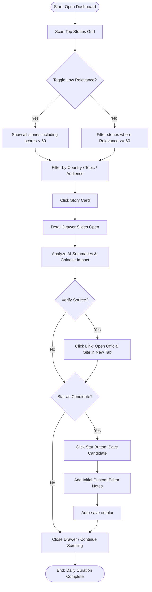
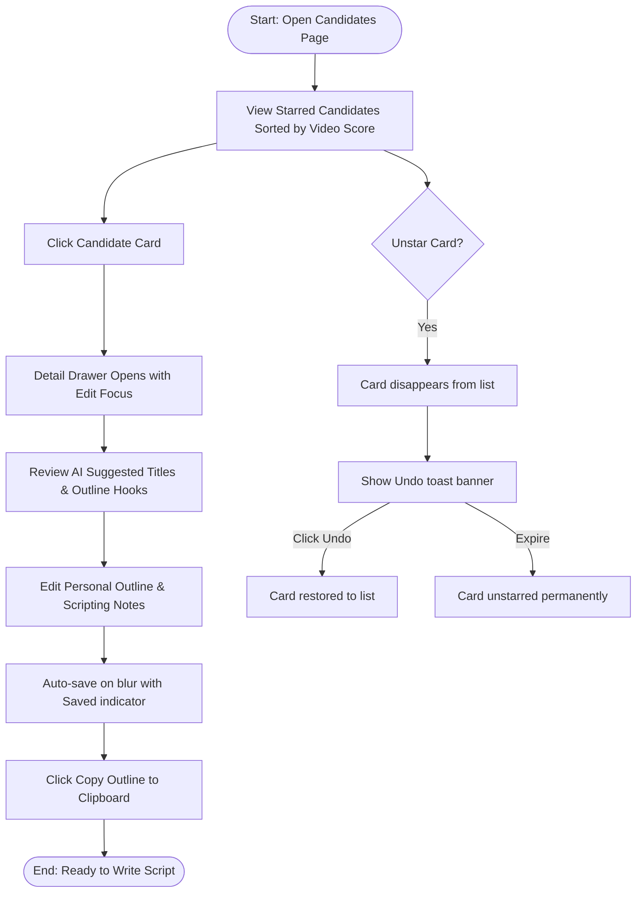

# User Flows Spec: Yutian Immigration AI Newsroom

This document outlines the user goals, persona journeys, and step-by-step navigation flows for the Yutian Immigration AI Newsroom.

---

## 1. Overview

### 1.1 Product Goals
The Yutian Immigration AI Newsroom (ImmiPulse) is a private, single-user editorial workspace. It aims to:
- Simplify daily global immigration policy monitoring.
- Highlight stories with the highest relevance to Chinese migrants.
- Reduce daily curation and weekly YouTube video drafting time to under 10 minutes.

### 1.2 Primary User
- **Yutian (The Creator):** Solitary editor, content creator, and scriptwriter for the YouTube channel *"雨田在海外"*.

### 1.3 Main Entry Points
1. **Direct Dashboard Entry (`/`):** The primary view Yutian accesses daily, showing the high-recommendation editorial feed.
2. **Candidates Section (`/candidates`):** A dedicated content workspace accessed weekly when drafting video outlines.

---

## 2. User Journeys

### 2.1 Daily News Review Journey
- **User Objective:** Efficiently review automated news feeds, identify high-priority stories, check details/sources, and flag video candidates.
- **Starting Point:** Dashboard (`/`)
- **Trigger:** Morning check of daily global updates.
- **Sequence Flow:**
  1. Open Dashboard (`/`). View list of grouped, translated, and graded news.
  2. Apply country, topic, or target-audience filters to narrow the feed.
  3. Scan the combined AI scores and YouTube title recommendations.
  4. Click on a story card. The **Detail Drawer** slides in from the right.
  5. Review translated summaries (English, Chinese, Original) and Chinese Audience Impact analysis.
  6. Click the original source link to verify the policy in a new browser tab.
  7. Return to the dashboard and click the **Star Candidate (⭐)** button to save the story.
  8. If notes are needed immediately, write annotations directly in the drawer.
- **Branching & Decision Points:**
  - *Chinese Relevance Gate:* Stories with a Chinese relevance score < 60 are hidden. Yutian can toggle "Show Low Relevance" to view them.
  - *Star/Unstar:* Toggles candidate status. Adding to candidates triggers a notification pill.
- **Validation Steps:**
  - Annotations text validation (minimum 1 character to trigger save, maximum 2000 characters).
- **Success Outcome:** Top stories reviewed, and 1–3 candidates starred for weekly production.
- **Cancellation & Recovery:**
  - Clicking outside the Drawer or hitting `Esc` closes the drawer instantly, preserving search queries, scroll position, and filters.
- **Error Handling:**
  - *API Timeout on Note Save:* If auto-save fails, display a warning pill "Sync Failed. Retrying..." with a retry link.

#### Mermaid Diagram: Daily News Review

---

### 2.2 Weekly Planning Journey
- **User Objective:** Review saved candidates, refine video outlines, add final script notes, and transition to scripting.
- **Starting Point:** Saved Candidates Page (`/candidates`)
- **Trigger:** Weekly scheduled content drafting day (typically Thursday).
- **Sequence Flow:**
  1. Click **Candidates** tab in global navigation sidebar.
  2. View the starred stories sorted by `video_score` (descending).
  3. Select the best-scoring candidate card.
  4. Review the AI-generated recommended titles and outline hooks in the drawer.
  5. Edit the Custom Outline/Notes text box. 
  6. View the draft indicator showing auto-save status.
  7. Copy the aggregated references and outline text using the "Copy Outline to Clipboard" button.
- **Success Outcome:** Video outline finalized and copied, ready for scripting environment.
- **Cancellation & Recovery:**
  - Unstarring a card in this view removes it from the candidate list immediately but offers an "Undo" banner toast at the bottom.
- **Error Handling:**
  - *Empty State:* If zero cards are starred, display an empty workspace card with a link returning to the main dashboard.

#### Mermaid Diagram: Weekly Planning Flow

---

## 3. Navigation Specifications

### 3.1 Screen Transitions
- **Sidebar Navigation:** Sidebar tabs navigate between `/` (Dashboard) and `/candidates` (Saved Candidates). Page contents transition with a subtle fade-in effect (150ms).
- **Detail Drawer slide:** Drawer transitions horizontally from the right edge. Desktop uses a 200ms ease-out translation (`transform: translateX(0)` from `translateX(100%)`). Mobile uses a vertical bottom-sheet slide-up transition from the bottom of the screen.

### 3.2 Modal and Focus Behavior
- **Non-blocking Drawer:** The drawer slides *over* the feed but maintains list state. Yutian can click the backdrop or click another card to swap drawer contents without closing and reopening.
- **Focus Management:** When the drawer opens to write notes, the text area does not auto-focus immediately to prevent keyboard overlays on mobile/tablet unless the user taps the text area.

### 3.3 Deep Linking
- **Story Links:** Every story metadata record supports deep-linking via query parameters (`/?story=ID`). If shared or refreshed, the page loads with the feed filtered/scrolled and the respective detail drawer open by default.
