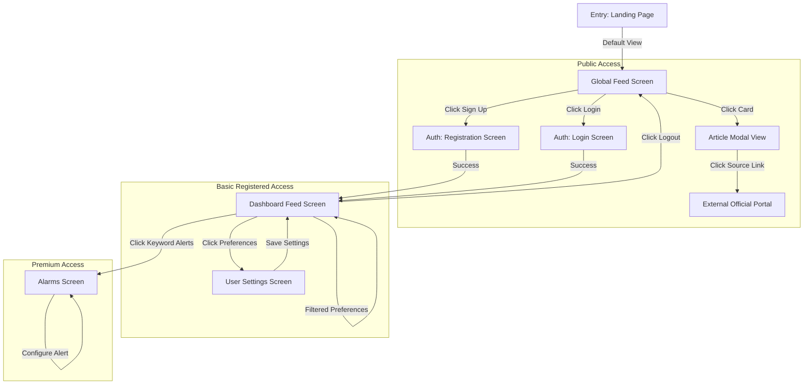

# ImmiPulse - User Flows

## 1. Overview
ImmiPulse provides a clean, highly curated, and transparent global immigration news portal. The primary goals are ensuring timeliness of policy changes, curating a noise-free feed (max 10 items), and maintaining complete transparency.

### Primary User Tiers
- **Unregistered Guest**: Visitors checking updates without an account.
- **Basic User (Free)**: Registered users who customize their feed and receive automated email digests.
- **Premium User (Paid)**: Subscribed users who configure custom keyword alerts and receive real-time email notifications.

---

## 2. Navigation System

---

## 3. Detailed User Journeys

### 3.1 Browse Public Feed (Unregistered Guest)
- **Objective**: Check the latest global immigration news quickly.
- **Starting Point**: Accessing the root URL of the application.
- **Navigation Sequence**:
  1. User arrives on the **Global Feed Screen**.
  2. The system renders the 10 latest articles globally (with a maximum of 2 items per jurisdiction).
  3. The preference sidebar is visible but locked (disabled with a tooltip prompting registration).
  4. User clicks an article card to open the **Article Modal**.
  5. User reviews the summary and clicks the verified source link to open the external government portal in a new tab.
- **Outcome**: User stays informed; is encouraged to register for personalized filtering.

### 3.2 Register & Customize Feed (Basic User)
- **Objective**: Filter feed by target jurisdictions and tags, and opt-in to digests.
- **Starting Point**: Global Feed Screen.
- **Navigation Sequence**:
  1. User clicks "Sign Up" in the navigation header.
  2. Enters email and password. Click "Register".
  3. On successful validation, the user is redirected to the **User Settings Screen**.
  4. User checks checkboxes for `Canada` and `Australia`, selects feature tags `Retirement` and `Vacation`, and sets email digest to `Daily`.
  5. Clicks "Save Preferences".
  6. The user is redirected to the **Dashboard Feed Screen**, which now displays a curated feed matching the selections (capped at 10 items total, diversity-enforced).
- **Validation**: Passwords must meet strength requirements (min 8 characters).
- **Outcome**: Personalized dashboard configured; email digests scheduled.

### 3.3 Set Up Real-Time Keyword Alerts (Premium User)
- **Objective**: Receive immediate email alerts when specific keywords are mentioned in official releases.
- **Starting Point**: Dashboard Feed Screen.
- **Navigation Sequence**:
  1. Premium user clicks "Keyword Alerts" in the dashboard sub-header.
  2. System navigates to the **Alarms Screen**.
  3. User enters a keyword (e.g., `Express Entry`) and selects the target jurisdiction (e.g., `Canada`).
  4. User clicks "Create Alarm".
  5. The new alarm is added to their active list.
  6. When a new matching non-duplicate article is published, the broker sends an email immediately.
- **Error Handling**: Creating duplicate keyword-jurisdiction combinations shows a validation error bubble.
- **Outcome**: Real-time notification rule established.
